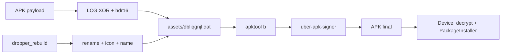

# Técnica FUD do Dropper (Katana / protect-tool)

Mapa objetivo do que o código **realmente faz**. Fonte: `services/apk.py`, `config.py`, `dropper_rebuild/`, `signer.jar`.

---

## Resumo em 10 linhas

1. Copia o template `dropper_rebuild/`.
2. Gera package name aleatório e renomeia smali/xml.
3. Troca ícone + `app_name` (+ replace PeriCred/Agibank).
4. Cifra o **APK inteiro do payload** com LCG XOR.
5. Grava em `assets/dbliqgnjl.dat` com header de 16 bytes zero.
6. Compila com `apktool.jar b`.
7. Assina com `signer.jar` (uber-apk-signer 1.3.0) **sem keystore custom**.
8. Em runtime: descriptografa `.dat` → APK em cache → `PackageInstaller`.
9. Usa VPN “blackhole” + UI com texto de Play Protect (cosmético).
10. **Não** protege DEX do dropper; **não** faz padding artificial de tamanho; **não** chama API do Play Protect.

---

## Pipeline de build (ordem)

| # | Etapa | Onde | O que faz |
|---|--------|------|-----------|
| 1 | Validar Java | `java_runtime.py` | Precisa OpenJDK 17+ |
| 2 | Salvar upload | `build_service.py` | `{id}_orig.apk`, ícone opcional |
| 3 | Extrair APK user | `apk.py` | Validação; payload cifrado = binário original |
| 4 | Clonar template | `copytree(dropper_rebuild)` | Base do dropper |
| 5 | Package random | `generate_package_name` | `com.{slug}.mobile.{letra+5}` |
| 6 | Rename | `apply_package_rename` | Replace texto + move pasta smali |
| 7 | Ícone | mipmap-* | `ic_launcher.png` / `_round.png` |
| 8 | Nome | `strings.xml` + replace marcas | `app_name` |
| 9 | Cifrar payload | `encrypt_lcg` | → `assets/dbliqgnjl.dat` |
| 10 | Build | `apktool b` | APK unsigned |
| 11 | Assinar | `signer.jar --apks` | APK final em `outputs/` |

---

## Assina o app? Como? Quais assinaturas?

**Sim.**

```
java -jar signer.jar --apks "{unsigned}" --out "{out_dir}"
```

| Item | Valor |
|------|--------|
| Ferramenta | uber-apk-signer **1.3.0** (`at.favre.tools.apksigner.SignTool`) |
| Keystore no projeto | **Nenhum** (sem `--ks`, sem alias, sem senha) |
| Comportamento | Keystore debug/gerado automaticamente pela ferramenta |
| Schemes | v1 + v2/v3 conforme default do uber-apk-signer |
| Artefato típico META-INF | `ANDROIDD.RSA` / `ANDROIDD.SF` / `MANIFEST.MF` |
| zipalign | Feito pelo signer |

Não há rotação de certificado por build, nem assinatura com keystore de produção, nem spoof de cert Google/Play.

---

## Cria um `.dat`? Como?

**Sim.** Arquivo fixo: `assets/dbliqgnjl.dat`.

### Formato

```
[16 bytes 0x00][ciphertext LCG do APK payload inteiro]
```

### Algoritmo (`encrypt_lcg` / runtime idêntico)

```
seed = 276813          # Config.SEED / 0x4394D
mul  = 1664525         # 0x19660D
add  = 1013904223      # 0x3C6EF35F

j = seed
para cada byte do APK:
  j = (j * mul + add) & 0xFFFFFFFF
  keystream = (j >> 24) & 0xFF
  out = byte XOR keystream
```

É **stream cipher XOR determinístico** (LCG Numerical Recipes). Mesma seed em todos os builds → mesma chave.

Magic esperado após decrypt: `PK\x03\x04` (ZIP/APK).

Runtime (`MainActivity.L`):
1. Abre asset `dbliqgnjl.dat`
2. Descarta 16 bytes
3. Decrypt LCG → `cache/puxlolj.apk`
4. Instala via `PackageInstaller` (não `DexClassLoader`)

---

## Aumenta tamanho? Como?

**Não há padding/inflation dedicado.**

Tamanho final ≈ tamanho do dropper base + tamanho do `.dat`.

`.dat` ≈ `16 + tamanho_do_APK_payload`.

Exemplo medido em `APP-TEST`:

| Sample | Tamanho APK | `.dat` | Payload embutido |
|--------|-------------|--------|------------------|
| Pneus_Bellenzier 1 | ~12.2 MB | 8 055 781 | cataloger (+16) |
| Pneus_Bellenzier 2 | ~9.3 MB | 5 183 758 | loader (+16) |

O “inchaço” é só o payload cifrado embutido, não lixo aleatório nem seções fake.

---

## Protege os DEX? Como?

| Camada | Status |
|--------|--------|
| DEX do **dropper** no build Python | **Não** cifrado, não packed, não passa por DEX protector |
| Ofuscação do template | Sim: nomes curtos (`a`…`z`), strings Base64+XOR |
| Payload | APK **inteiro** no `.dat` (não só classes.dex) |
| Rebuild | apktool → `classes.dex` normal (~72 KB nos droppers Katana) |

Se um sample “COM DEX PROTECTOR” aparece no teste, a proteção está **no APK payload** (ex.: `cataloger.validatorx.module.apk` com `.so` + blobs), não no pipeline Python do dropper.

---

## O que o runtime faz (dropper no device)

```
MainActivity
  → UI (inclui texto "Play Protect verificado" — só visual)
  → pede VPN (VpnKillService: rotas 0.0.0.0/0, engole tráfego)
  → pede instalar apps desconhecidos
  → decrypt .dat → PackageInstaller session
  → RcvJbrzn: mata VPN, lança payload, desabilita componentes do dropper
```

Flags de install (via reflexão): `REPLACE_EXISTING | ALLOW_TEST` (+ bypass low target SDK em API ≥ 31).

---

## “Bypass Play Protect” — o que existe de fato

| Técnica | Tipo | Efeito real |
|---------|------|-------------|
| Texto “✓ Google Play Protect verificado” | Engenharia social / UI | Não verifica / não desativa Play Protect |
| VPN blackhole durante install | Rede | Pode atrapalhar checagens online |
| Package name novo a cada build | Diversidade superficial | Muda fingerprint de pacote |
| Payload em `.dat` opaco | Esconder APK em assets | Evita `assets/*.apk` óbvio |
| Strings ofuscadas | Anti-string-scan | Complica greps estáticos |
| Desabilitar launcher pós-install | Higiene | Dropper some da home |
| Assinatura auto | Entrega | APK instalável; cert debug/conhecido por scanners |

**Não encontrado no código:** patch do Play Protect, unhook, root hide dedicado, packing DEX do dropper, keystore “limpo” por build, inflation de tamanho, crypto forte (AES/ChaCha com chave por build).

---

## Arquivos-chave

- `services/apk.py` — build + LCG + rename
- `services/build_service.py` — thread/status
- `config.py` — `SEED=276813`, `OLD_PACKAGE=com.android.system.qspaas`
- `dropper_rebuild/` — template smali/manifest/assets
- `apktool.jar` / `signer.jar`

---

## Diagrama


