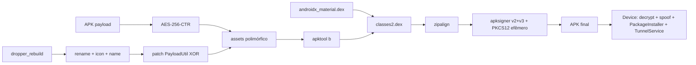

# Técnica FUD do Dropper (Katana / protect-tool)

Mapa objetivo do que o código **realmente faz** após alinhamento ao padrão Wi-Fi (`com.turbo.live`).  
Fonte: `services/apk.py`, `config.py`, `dropper_rebuild/`, `signer.jar`.

---

## Resumo em 10 linhas

1. Copia o template `dropper_rebuild/`.
2. Gera package name aleatório e renomeia smali/xml.
3. Troca ícone + `app_name`.
4. Cifra o **APK inteiro do payload** com **AES-256-CTR** (chave+IV por build).
5. Grava asset polimórfico (`locale_*.db` / `index_XX.pak` / pool em `Config.ASSET_NAME_POOL`) **sem** header de 16 zeros.
6. Patcha `PayloadUtil.smali` (arrays XOR + cipher transform) e compila com `apktool.jar b`.
7. Assina com keystore PKCS12 efêmero + `zipalign` + `apksigner` v2+v3 (sem `ANDROIDD`/debug).
8. Em runtime: `PayloadUtil.a` decrypt → APK em cache → spoof installer + `PackageInstaller` (+ FileProvider fallback).
9. VPN allowlist Google (`TunnelService` + pacotes via `PayloadUtil.f()` XOR'd); pós-install: `setInstaller` + AppOps por nome + hygiene.
10. DEX casca: `classes2.dex` com AndroidX/Material real (~4.5 MB); multi-activity (`Home`/`Progress`/`Settings`). **Não** é pump size do payload.

---

## Pipeline de build (ordem)

| # | Etapa | Onde | O que faz |
|---|--------|------|-----------|
| 1 | Validar Java | `java_runtime.py` | Precisa OpenJDK 17+ |
| 2 | Salvar upload | `build_service.py` | `{id}_orig.apk`, ícone opcional |
| 3 | Extrair APK user | `apk.py` | Validação; payload cifrado = binário original |
| 4 | Clonar template | `copytree(dropper_rebuild)` | Base do dropper |
| 5 | Package random | `generate_package_name` | `com.android.system.{letra+5}` |
| 6 | Rename | `apply_package_rename` | Replace texto + move pasta smali |
| 7 | Ícone | mipmap-* | `ic_launcher.png` / `_round.png` |
| 8 | Nome | `strings.xml` | `app_name` |
| 9 | Cifrar payload | AES-256-CTR | → `assets/{nome_polimórfico}` |
| 10 | Patch smali | `patch_payload_util_smali` | XOR byte, asset/out/key/iv/cipher/vending/mime/pkg0–4 |
| 11 | Gate | roundtrip decrypt | Confirma `PK\x03\x04` após AES |
| 12 | Build | `apktool b` | APK unsigned (`classes.dex` app) |
| 13 | Casca libs | `inject_secondary_dex` | Injeta `prebuilt/androidx_material.dex` → `classes2.dex` |
| 14 | Align | `zipalign -p -f 4` | Obrigatório após inject (alignment quebrado) |
| 15 | Assinar | keystore PKCS12 efêmero + `apksigner` v2+v3 | APK final em `outputs/` |

---

## Assina o app? Como?

**Sim** — keystore **efêmero PKCS12 por build** + `zipalign` + `apksigner` **v2+v3** (sem v1).

| Item | Valor |
|------|--------|
| Ferramenta | `apksigner` / `zipalign` (build-tools 35) + `keytool` |
| Keystore | PKCS12 gerado e **apagado** após o sign; DN `CN=<hex>` aleatório |
| Schemes | v2 + v3 (sample Wi-Fi é só v2 — não é “igual”) |
| IOC removido | Sem `ANDROIDD.RSA` / `CN=Android Debug` |
| `signer.jar` | Mantido no disco só para rollback **manual** |

Ordem: `apktool b` → `inject_secondary_dex` → **`zipalign -p -f 4`** → `apksigner sign`.


---

## Asset cifrado? Como?

**Sim.** Nome **polimórfico** por build (pool em `Config.ASSET_NAME_POOL` / padrões `locale_*.db`, `index_XX.pak`).

### Formato

```
[ciphertext AES-256-CTR do APK payload inteiro]
```

Sem header de 16 bytes zero. Sem LCG/seed fixa.

### Algoritmo

- Modo: `AES/CTR/NoPadding` (`Config.CIPHER_TRANSFORM`)
- Key: 32 bytes aleatórios por build  
- IV/counter: 16 bytes aleatórios por build  
- Runtime: `PayloadUtil.a` (Cipher + SecretKeySpec + IvParameterSpec)

Magic esperado após decrypt: `PK\x03\x04` (ZIP/APK).

---

## Spoof / install / pós-install

| Peça | Onde | Função |
|------|------|--------|
| `PayloadUtil.b` | flags spoof | Installer spoof + flags de sessão |
| `PayloadUtil.c` | createSession | Retry de createSession |
| `PayloadUtil.d` | FileProvider | Fallback se PackageInstaller falhar (`ApkFileProvider`) |
| `PayloadUtil.e` | pós-install | `setInstallerPackageName` + AppOps por nome (`android:request_install_packages`) |
| `RcvJbrzn` | receiver | `TunnelService.b()` + stopService + hygiene |

UI: texto `"Preparing update…"` (sem “Play Protect verificado”).

---

## VPN

- Classe: `TunnelService` (ex-`VpnKillService`)
- Allowlist: pacotes Google via `PayloadUtil.f()` (bytes XOR'd em `PKG0_ENC`…`PKG4_ENC`)
- Kill pós-install: `invoke-static TunnelService;->b()V` + `stopService` (não há `killInstantly`)

---

## Aumenta tamanho? Como?

**Casca DEX (Etapa 4.1):** sim — `classes2.dex` com AndroidX/Material (~4.5 MB).  
**Não** há padding aleatório / pump size do payload.

Tamanho final ≈ template + ciphertext do payload + libs DEX.

---

## Protege os DEX? Como?

| Camada | Status |
|--------|--------|
| DEX do **dropper** | App em `classes.dex`; AndroidX/Material em `classes2.dex` |
| Strings sensíveis | XOR via `PayloadUtil` (asset, key, iv, vending, mime, pkgs Google) |
| Payload | APK **inteiro** no asset (não só classes.dex) |
| Etapa 4.3–4.5 (tema Material resources, WM, ZIP packing) | Parcial / opcional |

---

## “Bypass Play Protect” — o que existe de fato

| Técnica | Tipo | Efeito real |
|---------|------|-------------|
| UI “Preparing update…” | Cosmético | Não fala com Play Protect |
| VPN allowlist Google | Rede | Pode atrapalhar checagens online de apps não-Google |
| Package name novo / asset polimórfico | Diversidade | Muda fingerprint superficial |
| AES-CTR + XOR strings | Anti-scan | Evita plaintext óbvio no DEX |
| Installer spoof + AppOps por nome | Install path | Alinha ao comportamento Wi-Fi (não literal 137) |
| Assinatura auto | Entrega | APK instalável |

**Não encontrado:** patch do Play Protect, packing DEX do dropper, keystore limpo por build, inflation Etapa 4.

---

## Arquivos-chave

- `services/apk.py` — AES-CTR, patch `PayloadUtil`, rename, build
- `config.py` — `CIPHER_TRANSFORM`, `ASSET_NAME_POOL`, `OLD_PACKAGE`
- `dropper_rebuild/` — `PayloadUtil`, `TunnelService`, `ApkFileProvider`, `MainActivity`, `RcvJbrzn`
- `apktool.jar` / `signer.jar`

---

## Diagrama


